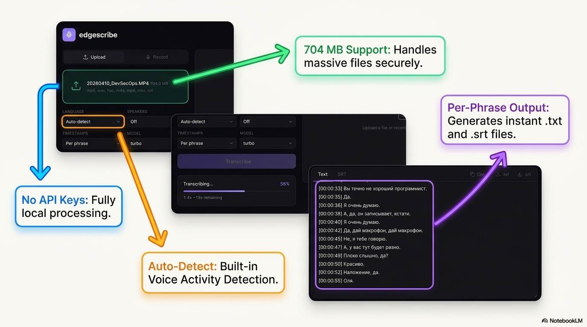
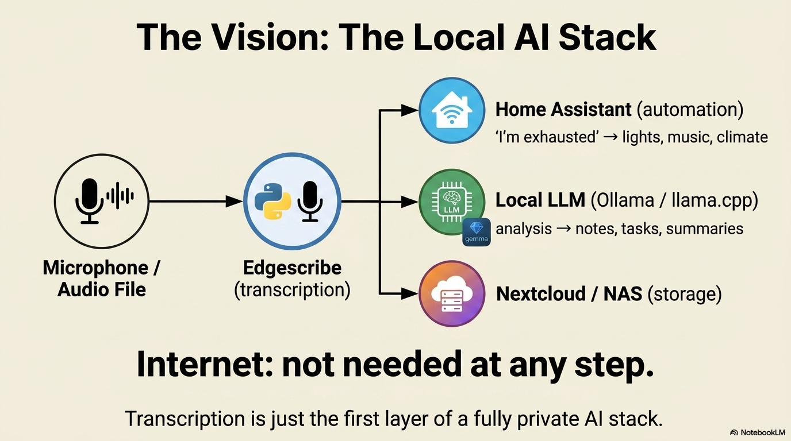

# edgescribe

Local audio/video transcription. Runs on your machine, offline, no API keys.




## [Click here to view the Presentation](presentation/Local_Whisper_Blueprint.pdf)

## Setup

Requires Python 3.9+, FFmpeg, 8 GB RAM.

```bash
git clone https://github.com/mikebionic/edgescribe.git
cd edgescribe
make setup
```

First run downloads the Whisper model (~1.5 GB). After that everything works offline.

## Web UI

```bash
make serve
# open http://localhost:8000
```

Upload files or record voice directly in the browser. Supports multi-file batch processing.

## CLI

```bash
# transcribe a file
.venv/bin/python transcribe.py -i recording.mp3

# transcribe a folder
.venv/bin/python transcribe.py -i /path/to/audio/

# specify language
.venv/bin/python transcribe.py -i meeting.mp3 -l en

# speaker diarization
.venv/bin/python diarize.py -i interview.mp3 -s 2
```

### Transcribe options

| Flag | Default | Description |
|------|---------|-------------|
| `-i` | `.` | Audio file or folder |
| `-m` | `large-v3-turbo` | Model: `large-v3-turbo`, `large-v3`, `medium`, `small`, `base` |
| `-l` | `auto` | Language code: `auto`, `ru`, `en`, `de`, `tk`, `tr`, ... |
| `-t` | `auto` | Timestamps: `auto`, `none`, `10`, `30` |
| `--overwrite` | off | Overwrite existing output |

### Diarize options

| Flag | Default | Description |
|------|---------|-------------|
| `-i` | required | Audio file or folder |
| `-s` | `2` | Number of speakers |
| `-m` | `simple` | Method: `simple` or `speechbrain` |

## REST API

```bash
.venv/bin/python api.py
# http://localhost:8000/docs
```

| Method | Endpoint | Description |
|--------|----------|-------------|
| `POST` | `/v1/transcribe` | Upload file, returns job_id |
| `GET` | `/v1/jobs/{id}` | Job status and result |
| `GET` | `/v1/jobs/{id}/download/{fmt}` | Download .txt or .srt |
| `GET` | `/v1/jobs` | List all jobs |
| `DELETE` | `/v1/jobs/{id}` | Delete job |
| `GET` | `/v1/health` | Health check |

API key: `--api-key SECRET` or `EDGESCRIBE_API_KEY` env var.

## Project structure

```
edgescribe/
  api.py              - FastAPI server + web UI
  transcribe.py       - CLI transcription
  diarize.py          - CLI speaker diarization
  core/
    engine.py         - Whisper model cache + transcription
    diarize.py        - Speaker diarization (simple + speechbrain)
    format.py         - Timestamps, segment grouping, merging
    audio.py          - FFmpeg utilities
  static/
    index.html        - Web UI
    style.css
    app.js
  tests/
    test_format.py
    test_api.py
```

## Make commands

```
make setup         - Full install (venv + deps + model)
make serve         - Start web UI + API
make transcribe    - Transcribe all audio in current dir
make clean         - Remove venv and caches
make clean-models  - Remove downloaded models
```


