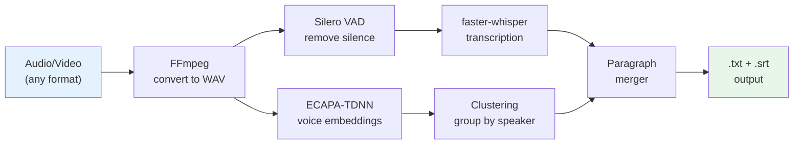

<p align="center">
  <h1 align="center">edgescribe</h1>
  <p align="center">
    Private, local, offline audio & video transcription.<br>
    No cloud. No API keys. No data leaves your machine.
  </p>
</p>

<p align="center">
  
  
  
  
  <br>
  
  
  
</p>

<p align="center">
  <b>
    <a href="#quick-start">Quick Start</a> &bull;
    <a href="#gui">GUI</a> &bull;
    <a href="#cli">CLI</a> &bull;
    <a href="#speaker-diarization">Speakers</a> &bull;
    <a href="#privacy">Privacy</a>
  </b>
</p>

---

## Why

Every time you upload audio to a cloud transcription service (TurboScribe, Otter.ai, 11 Labs), your recordings end up in someone else's database. Personal conversations, meetings, interviews - stored on servers you don't control.

**edgescribe** runs entirely on your computer. Your audio never leaves your machine.

```
Your audio ──> [YOUR computer] ──> .txt / .srt files
                     │
                     └── nothing goes to the internet
```

---

## Tech Stack

| Component | Technology | Purpose |
|-----------|-----------|---------|
|  | Python 3.9+ | Core language |
|  | [faster-whisper](https://github.com/SYSTRAN/faster-whisper) | Speech-to-text engine |
|  | [Gradio](https://gradio.app) | Web GUI |
|  | [SpeechBrain](https://speechbrain.github.io) | Speaker embeddings |
|  | [FFmpeg](https://ffmpeg.org) | Audio conversion |
|  | Silero VAD | Voice activity detection |

---

## Features

- **Transcription** - speech-to-text using Whisper large-v3-turbo
- **30+ languages** - auto-detection or manual selection
- **Speaker diarization** - identify who is speaking (2-10 speakers, no API keys)
- **GUI** - web interface with drag & drop, live progress, ZIP download
- **CLI** - batch processing, scriptable, all options via flags
- **Multiple formats** - MP3, WAV, FLAC, M4A, OGG, AAC, MP4, MKV, AVI, MOV...
- **Timestamps** - per-phrase, fixed intervals (5s/10s/30s), or plain text
- **Output** - `.txt` (plain text) + `.srt` (subtitles)
- **Offline** - works without internet after initial model download (~1.5 GB)

---

## Quick Start

### Prerequisites

| Requirement | Minimum | Recommended |
|-------------|---------|-------------|
| **Python** | 3.9 | 3.11+ |
| **RAM** | 8 GB | 16 GB |
| **Disk** | 3 GB | 5 GB |
| **FFmpeg** | Required | Required |
| **OS** | Linux / macOS / Windows (WSL2) | |

#### Install FFmpeg (if not installed)

<details>
<summary><b>Linux (Ubuntu/Debian)</b></summary>

```bash
sudo apt update && sudo apt install ffmpeg
```
</details>

<details>
<summary><b>macOS</b></summary>

```bash
brew install ffmpeg
```
</details>

<details>
<summary><b>Windows (WSL2)</b></summary>

```bash
# Inside WSL2 terminal:
sudo apt update && sudo apt install ffmpeg
```
</details>

### Installation

```bash
# 1. Clone
git clone https://github.com/mikebionic/edgescribe.git
cd edgescribe

# 2. Setup (creates venv, installs deps, downloads model)
make setup
# or: chmod +x setup.sh && ./setup.sh
```

First run downloads the Whisper model (~1.5 GB). After that, everything works offline.

---

## GUI

Web interface at `http://localhost:7860`. Drag files in, get text out.

```bash
make gui
# or: .venv/bin/python gui.py
```

**What the GUI gives you:**

- Drag & drop multiple audio/video files
- Live progress log: percentage, speed (e.g. `2.3x realtime`), ETA
- Language selection (30+ languages or auto-detect)
- Speaker identification (2-10 speakers)
- Results in both `.txt` and `.srt` tabs
- Download all results as ZIP
- Auto-save to a specified folder

---

## CLI

### Transcribe

```bash
# Single file
.venv/bin/python transcribe.py --input recording.mp3

# Entire folder
.venv/bin/python transcribe.py --input /path/to/audio/

# Specify language (faster, more accurate)
.venv/bin/python transcribe.py --input meeting.mp3 --language en

# Clean text, no timestamps
.venv/bin/python transcribe.py --input podcast.mp3 --timestamps none

# Group text in 30-second blocks
.venv/bin/python transcribe.py --input lecture.mp3 --timestamps 30

# Use faster (less accurate) model
.venv/bin/python transcribe.py --input file.mp3 --model medium
```

**All options:**

| Flag | Default | Description |
|------|---------|-------------|
| `--input`, `-i` | `.` (current dir) | Audio file or folder |
| `--model`, `-m` | `large-v3-turbo` | Whisper model: `large-v3-turbo`, `large-v3`, `medium`, `small`, `base` |
| `--language`, `-l` | `auto` | Language: `auto`, `ru`, `en`, `de`, `fr`, `es`, `zh`, `tk`... |
| `--timestamps`, `-t` | `auto` | `auto` (per phrase), `none`, or seconds (`5`, `10`, `30`) |
| `--threads` | `8` | CPU threads |
| `--overwrite` | off | Overwrite existing .txt/.srt |

### Speaker Diarization

Identify who is speaking. No API keys, no registration.

```bash
# 2 speakers
.venv/bin/python diarize.py --input interview.mp3 --speakers 2

# 5 speakers, faster method
.venv/bin/python diarize.py --input meeting.mp3 --speakers 5 --method speechbrain
```

**Output example:**
```
[00:00:05] SPEAKER_00: So tell me about your experience...
[00:00:12] SPEAKER_01: I've been working in this field for about ten years.
[00:00:18] SPEAKER_00: What would you say was the biggest challenge?
```

If a `.srt` file already exists next to the audio (from a previous transcription), speaker labels are automatically merged with the text.

| Flag | Default | Description |
|------|---------|-------------|
| `--input`, `-i` | *(required)* | Audio file or folder |
| `--speakers`, `-s` | `2` | Number of speakers |
| `--method`, `-m` | `simple` | `simple` (more accurate) or `speechbrain` (faster) |

---

## How It Works



1. **FFmpeg** converts any audio/video format to 16kHz mono WAV
2. **Silero VAD** detects speech vs. silence - reduces Whisper hallucinations
3. **faster-whisper** (CTranslate2-optimized Whisper) transcribes speech with timestamps
4. **ECAPA-TDNN** extracts voice embeddings (a "fingerprint" for each voice)
5. **Agglomerative Clustering** groups segments by speaker identity
6. **Paragraph Merger** combines short segments into readable paragraphs

All processing runs on **CPU**. No GPU required.

---

## Performance

Tested on AMD Ryzen 7 PRO (CPU only, 14 GB RAM):

| Audio length | Model | Time | Speed |
|-------------|-------|------|-------|
| 20 min | large-v3-turbo | ~10 min | **2x realtime** |
| 1 hour | large-v3-turbo | ~30 min | 2x |
| 1 hour | medium | ~15 min | 4x |
| 1 hour | small | ~8 min | 7.5x |

Speaker diarization adds 3-10 min depending on audio length.

### Model comparison

| Model | Download | Quality | Speed | Best for |
|-------|----------|---------|-------|----------|
| **large-v3-turbo** | 1.5 GB | Excellent | 2x | **Recommended** |
| large-v3 | 3 GB | Best | 1x | Maximum accuracy |
| medium | 1.5 GB | Good | 4x | Faster processing |
| small | 500 MB | OK | 7x | Quick drafts |
| base | 150 MB | Basic | 15x | Very weak hardware |

---

## Privacy

This is the entire point of this project.

| When | What goes to the internet |
|------|--------------------------|
| `make setup` (first time only) | Downloads packages + model (~1.5 GB) |
| **Any transcription command** | **Nothing. Zero. Nada.** |

After setup, disconnect from the internet. Everything works.

**Verify it yourself:**
```bash
# While transcribing, check network connections:
ss -tunp | grep python
# Should show: nothing

# Or monitor all traffic:
sudo nethogs
# Python: 0 bytes sent/received
```

The tool sets `HF_HUB_OFFLINE=1` at startup to prevent even accidental connections.

---

## Supported Languages

Auto-detection works well. For best results, specify manually:

`af` `am` `ar` `as` `az` `ba` `be` `bg` `bn` `bo` `br` `bs` `ca` `cs` `cy` `da` `de` `el` **`en`** `es` `et` `eu` `fa` `fi` `fo` **`fr`** `gl` `gu` `ha` `haw` `he` `hi` `hr` `ht` `hu` `hy` `id` `is` `it` **`ja`** `jw` `ka` `kk` `km` `kn` **`ko`** `la` `lb` `ln` `lo` `lt` `lv` `mg` `mi` `mk` `ml` `mn` `mr` `ms` `mt` `my` `ne` `nl` `nn` `no` `oc` `pa` `pl` `ps` `pt` `ro` **`ru`** `sa` `sd` `si` `sk` `sl` `sn` `so` `sq` `sr` `su` `sv` `sw` `ta` `te` `tg` `th` **`tk`** `tl` **`tr`** `tt` `uk` `ur` `uz` `vi` `yo` **`zh`** `zu`

---

## Project Structure

```
edgescribe/
├── transcribe.py     # CLI: batch transcription
├── diarize.py        # CLI: speaker identification
├── gui.py            # Web GUI (Gradio, localhost:7860)
├── setup.sh          # One-command installation
├── Makefile           # make setup / make gui / make transcribe
├── requirements.txt   # Python dependencies
├── pyproject.toml     # Package metadata
├── LICENSE            # MIT
└── article.md         # Blog post / Medium article draft
```

---

## Make Commands

```bash
make help          # Show all commands
make setup         # Full installation
make install       # Install dependencies only
make gui           # Launch web GUI
make transcribe    # Transcribe all audio in current directory
make clean         # Remove venv and caches
make clean-models  # Remove downloaded models (~1.5 GB)
```

---

## Troubleshooting

<details>
<summary><b>"Model not found" on first run</b></summary>

First run needs internet to download the model (~1.5 GB). Run `make setup` with an internet connection.
</details>

<details>
<summary><b>Slow transcription</b></summary>

- Use a faster model: `--model medium` or `--model small`
- Increase threads: `--threads 16`
- Close other heavy applications (browsers, etc.)
</details>

<details>
<summary><b>Speaker diarization fails</b></summary>

Make sure FFmpeg is installed. The diarizer converts audio to WAV via FFmpeg before processing.
```bash
ffmpeg -version  # should print version info
```
</details>

<details>
<summary><b>Out of memory (OOM)</b></summary>

- Use a smaller model: `--model small`
- Close browsers and other apps
- Add swap space:
```bash
sudo fallocate -l 8G /swapfile
sudo mkswap /swapfile
sudo swapon /swapfile
```
</details>

---

## License

[MIT](LICENSE)
