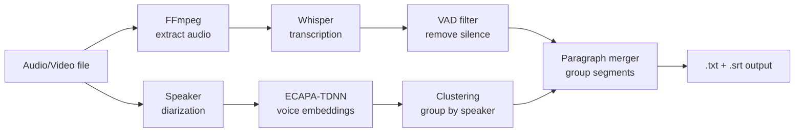

# local-transcribe

**Private, local, offline audio & video transcription.**

No cloud. No API keys. No data leaves your machine.

---

## Why this exists

Every time you upload audio to TurboScribe, Otter.ai, 11 Labs, or any cloud transcription service, your recordings end up in someone else's database. Personal conversations, meetings, interviews, sensitive discussions - all stored on servers you don't control.

I wanted a simple way to transcribe audio **locally**, on my own machine, without any data going anywhere. Turns out you don't need expensive GPUs or cloud subscriptions. A regular laptop with 8+ GB RAM handles it just fine.

This project gives you:
- **CLI** for batch transcription from the terminal
- **GUI** (web interface) for drag-and-drop transcription in the browser
- **Speaker identification** (who said what) - also fully local
- **30+ languages** supported out of the box

All powered by [faster-whisper](https://github.com/SYSTRAN/faster-whisper) (OpenAI Whisper, optimized for CPU).

```
Your audio files ──> [local-transcribe on YOUR machine] ──> .txt / .srt files
                     Nothing goes to the internet ↑
```

---

## Features

| Feature | Details |
|---------|---------|
| **Transcription** | Speech-to-text using Whisper large-v3-turbo |
| **Speaker diarization** | Identify who is speaking (2-10 speakers) |
| **30+ languages** | Auto-detection or manual selection |
| **Multiple formats** | MP3, WAV, FLAC, M4A, OGG, AAC, MP4, MKV, AVI, MOV... |
| **GUI** | Gradio web interface at `localhost:7860` |
| **CLI** | Batch processing, scriptable |
| **Timestamps** | Per-phrase, fixed intervals (5s/10s/30s), or none |
| **Output** | `.txt` (plain text) + `.srt` (subtitles) |
| **Privacy** | 100% local. Zero network calls during transcription |
| **Offline** | Works without internet after initial model download (~1.5 GB) |

---

## Quick start

### 1. Clone and setup

```bash
git clone https://github.com/YOUR_USERNAME/local-transcribe.git
cd local-transcribe
chmod +x setup.sh
./setup.sh
```

The setup script will:
- Check Python 3.9+, ffmpeg, RAM
- Create a virtual environment
- Install all dependencies
- Download the Whisper model (~1.5 GB, one time)

### 2. Transcribe

**GUI (recommended for beginners):**
```bash
.venv/bin/python gui.py
# Opens in browser at http://localhost:7860
```

**CLI:**
```bash
# Single file
.venv/bin/python transcribe.py --input recording.mp3

# Entire folder
.venv/bin/python transcribe.py --input /path/to/audio/

# Specify language
.venv/bin/python transcribe.py --input meeting.mp3 --language en

# Without timestamps (clean text)
.venv/bin/python transcribe.py --input podcast.mp3 --timestamps none
```

### 3. Identify speakers

```bash
# Who said what?
.venv/bin/python diarize.py --input meeting.mp3 --speakers 2

# More speakers
.venv/bin/python diarize.py --input conference.mp3 --speakers 5

# Faster method (less accurate)
.venv/bin/python diarize.py --input audio.mp3 --speakers 2 --method speechbrain
```

---

## How it works



### Architecture

| Component | Library | Purpose |
|-----------|---------|---------|
| Transcription | [faster-whisper](https://github.com/SYSTRAN/faster-whisper) | CTranslate2-optimized Whisper inference |
| Voice Activity | [Silero VAD](https://github.com/snakers4/silero-vad) | Filter silence, reduce hallucinations |
| Speaker embeddings | [SpeechBrain ECAPA-TDNN](https://huggingface.co/speechbrain/spkrec-ecapa-voxceleb) | Extract voice fingerprints |
| Speaker clustering | [simple_diarizer](https://github.com/cvqluu/simple_diarizer) | Group embeddings into speakers |
| GUI | [Gradio](https://gradio.app/) | Web interface |
| Audio conversion | [FFmpeg](https://ffmpeg.org/) | Format conversion |

### Processing pipeline

1. **Audio input** - any format supported by FFmpeg
2. **Whisper transcription** - segments with timestamps and text
3. **VAD filtering** - removes silence gaps (min 500ms)
4. **Paragraph merging** - groups short segments into readable paragraphs (by speaker + pause detection)
5. **Speaker diarization** (optional) - ECAPA-TDNN voice embeddings + agglomerative clustering
6. **Output** - `.txt` with timestamps and `.srt` subtitles

---

## GUI screenshot

The web interface provides:
- Drag & drop multiple files
- Live progress log with percentage, speed (e.g. `2.3x realtime`), and ETA
- Language and model selection
- Speaker detection settings
- Output in both text and subtitle formats
- Download all results as ZIP

---

## Performance

Tested on AMD Ryzen 7 PRO 6850U (CPU only, 14 GB RAM):

| Audio duration | Model | Transcription time | Speed |
|---------------|-------|-------------------|-------|
| 20 min | large-v3-turbo | ~10 min | 2x realtime |
| 1 hour | large-v3-turbo | ~30 min | 2x realtime |
| 1 hour | medium | ~15 min | 4x realtime |
| 1 hour | small | ~8 min | 7.5x realtime |

Speaker diarization adds 3-10 minutes depending on audio length.

### Model comparison

| Model | Size | Quality | Speed | Best for |
|-------|------|---------|-------|----------|
| `large-v3-turbo` | 1.5 GB | Excellent | 2x | **Recommended default** |
| `large-v3` | 3 GB | Best | 1x | Maximum accuracy |
| `medium` | 1.5 GB | Good | 4x | Faster processing |
| `small` | 500 MB | OK | 7x | Quick drafts, weak hardware |
| `base` | 150 MB | Basic | 15x | Very weak hardware |

---

## CLI reference

### transcribe.py

```bash
python transcribe.py [OPTIONS]

Options:
  --input, -i     Audio file or folder (default: current directory)
  --model, -m     Whisper model: large-v3-turbo, large-v3, medium, small, base
  --language, -l  Language: auto, ru, en, de, fr, es, zh, ja, ko, tk, tr, ...
  --timestamps,-t Timestamp mode: auto (per phrase), none, or seconds (5, 10, 30)
  --threads       CPU threads (default: 8)
  --overwrite     Overwrite existing .txt/.srt files
```

### diarize.py

```bash
python diarize.py [OPTIONS]

Options:
  --input, -i     Audio file or folder (required)
  --speakers, -s  Number of speakers (default: 2)
  --method, -m    simple (accurate) or speechbrain (faster)
```

### gui.py

```bash
python gui.py
# Opens http://localhost:7860 in browser
```

---

## Privacy

This is the whole point of this project. Here's exactly what happens:

| When | What goes to the internet | Where |
|------|--------------------------|-------|
| `./setup.sh` (first time) | Downloads Python packages + Whisper model (~1.5 GB) | PyPI, HuggingFace |
| `python transcribe.py` | **NOTHING** | **NOWHERE** |
| `python gui.py` | **NOTHING** | **NOWHERE** |
| `python diarize.py` | **NOTHING** | **NOWHERE** |

After setup, you can disconnect from the internet entirely. Everything runs on your CPU.

### Verify yourself

```bash
# During transcription, check network connections:
ss -tunp | grep python
# Should show NOTHING (no connections)

# Or monitor traffic:
sudo nethogs
# Python process should show 0 bytes sent/received
```

---

## Supported languages

Auto-detection works well, but you can specify explicitly for better accuracy:

`af, am, ar, as, az, ba, be, bg, bn, bo, br, bs, ca, cs, cy, da, de, el, en, es, et, eu, fa, fi, fo, fr, gl, gu, ha, haw, he, hi, hr, ht, hu, hy, id, is, it, ja, jw, ka, kk, km, kn, ko, la, lb, ln, lo, lt, lv, mg, mi, mk, ml, mn, mr, ms, mt, my, ne, nl, nn, no, oc, pa, pl, ps, pt, ro, ru, sa, sd, si, sk, sl, sn, so, sq, sr, su, sv, sw, ta, te, tg, th, tk, tl, tr, tt, uk, ur, uz, vi, yo, zh, zu`

---

## Troubleshooting

### "Model not found" error
First run needs internet to download the model. Run `./setup.sh` with internet connection.

### Slow transcription
- Use `medium` or `small` model: `--model medium`
- Increase threads: `--threads 16`
- Close other heavy applications

### Speaker diarization fails
- Make sure ffmpeg is installed: `sudo apt install ffmpeg`
- The diarizer needs WAV format - ffmpeg converts automatically

### Out of memory
- Use a smaller model: `--model small`
- Close browsers and other apps
- Add swap: `sudo fallocate -l 8G /swapfile && sudo mkswap /swapfile && sudo swapon /swapfile`

---

## Requirements

- **Python** 3.9+
- **RAM** 8 GB minimum (16 GB recommended for large-v3-turbo)
- **Disk** ~3 GB for model + dependencies
- **FFmpeg** (for non-WAV audio formats)
- **OS** Linux, macOS, Windows (WSL2)
- **GPU** Not required - runs on CPU

---

## License

MIT
