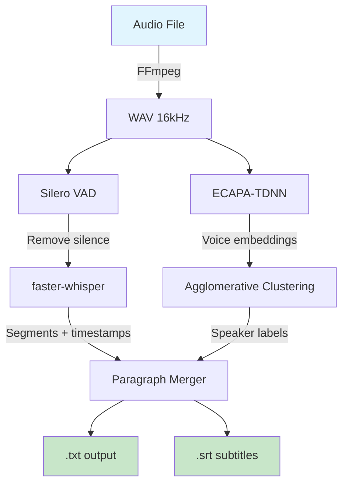
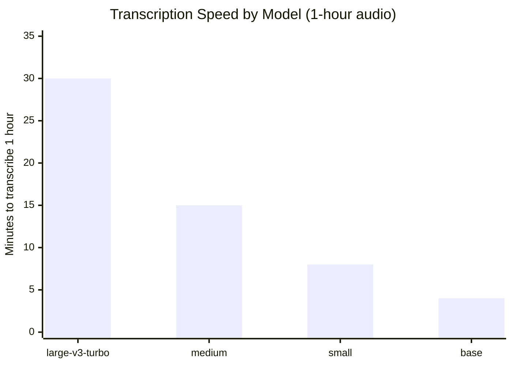

# I Stopped Uploading My Audio to the Cloud. Here's What I Built Instead.

*A fully local, offline transcription tool that keeps your data on your machine.*

---

Every time you drag a recording into TurboScribe, Otter.ai, or any cloud transcription service, your audio ends up on someone else's server. Meeting recordings, personal conversations, interviews - stored in databases you don't control, used to train models you didn't consent to, subject to data breaches you'll never know about.

I got tired of this trade-off: **convenience vs. privacy**. So I built a tool that gives you both.

## The Problem

Here's what happens when you use a cloud transcription service:

```
Your audio ──upload──> [Cloud Server] ──> transcript
                           │
                           ├── stored in their database
                           ├── possibly used for training
                           ├── subject to their privacy policy
                           └── you have no real control
```

And here's what I wanted:

```
Your audio ──> [YOUR computer] ──> transcript
                     │
                     └── nothing leaves your machine. ever.
```

The technology to do this locally has existed for a while (OpenAI's Whisper), but setting it up was painful: CUDA dependencies, model management, command-line gymnastics. I wanted something that anyone could install and use in 5 minutes.

## What I Built

**local-transcribe** - an open-source tool with three interfaces:

### 1. GUI (for everyone)

A web interface that opens in your browser. Drag files in, get text out.

```bash
python gui.py
# Opens http://localhost:7860
```

Features:
- Drag & drop multiple files
- Live progress: percentage, speed (`2.3x realtime`), ETA
- Speaker identification (who said what)
- 30+ languages with auto-detection
- Download results as ZIP

### 2. CLI (for power users)

```bash
# Transcribe a single file
python transcribe.py --input meeting.mp3

# Entire folder, English only
python transcribe.py --input ~/recordings/ --language en

# Clean text without timestamps
python transcribe.py --input podcast.mp3 --timestamps none
```

### 3. Speaker Diarization

Identifies who is speaking when. No API keys, no registration.

```bash
python diarize.py --input interview.mp3 --speakers 2
```

Output:
```
[00:00:05] SPEAKER_00: So tell me about your experience...
[00:00:12] SPEAKER_01: I've been working in this field for about ten years.
[00:00:18] SPEAKER_00: What would you say was the biggest challenge?
```

## How It Works Under the Hood



The pipeline:

1. **FFmpeg** converts any audio/video format to 16kHz WAV
2. **Silero VAD** (Voice Activity Detection) removes silence - this prevents hallucinations where Whisper "hears" words in silence
3. **faster-whisper** (CTranslate2-optimized Whisper) transcribes speech to text with timestamps
4. **ECAPA-TDNN** extracts voice embeddings (a "fingerprint" of each voice)
5. **Agglomerative Clustering** groups similar voice segments into speakers
6. **Paragraph Merger** combines short segments into readable paragraphs based on speaker changes and pauses

All of this runs on your CPU. No GPU needed.

## Performance (Real Numbers)

I tested on a regular laptop: AMD Ryzen 7, 14 GB RAM, no dedicated GPU.

| Audio Length | Model | Time | Speed |
|-------------|-------|------|-------|
| 20 minutes | large-v3-turbo | 10 min | **2x faster than realtime** |
| 1 hour | large-v3-turbo | 30 min | 2x |
| 1 hour | medium | 15 min | 4x |
| 1 hour | small | 8 min | 7.5x |



The `large-v3-turbo` model is the sweet spot: excellent quality at 2x realtime speed. A 1-hour meeting takes about 30 minutes to transcribe.

Speaker diarization adds 3-10 minutes depending on audio length.

## Quality: Cloud vs. Local

| Aspect | Cloud (e.g. TurboScribe) | Local (this tool) |
|--------|--------------------------|-------------------|
| Accuracy | Very good | Very good (same Whisper model) |
| Speed | Fast (GPU servers) | 2-4x realtime (CPU) |
| Languages | 30+ | 30+ |
| Speaker ID | Yes (cloud-based) | Yes (local, no API keys) |
| Privacy | Your data on their servers | **Your data stays on your machine** |
| Cost | $10-20/month | **Free forever** |
| Offline | No | **Yes** |
| Batch processing | Limited | **Unlimited** |

The transcription quality is essentially the same - both use OpenAI's Whisper model. The main trade-off is speed: cloud services use GPUs and return results faster. But for most use cases, 2x realtime on CPU is more than acceptable.

## Privacy: Verified

I don't ask you to trust me. Verify it yourself:

```bash
# While transcribing, check network connections:
ss -tunp | grep python
# Output: nothing. Zero connections.

# Or watch network traffic:
sudo nethogs
# Python shows 0 bytes sent/received
```

The tool sets `HF_HUB_OFFLINE=1` at startup, which prevents even accidental connection attempts to HuggingFace (the model host).

After the initial setup (which downloads the model ~1.5 GB), you can disconnect from the internet completely. It will work fine.

## Setup (5 minutes)

```bash
git clone https://github.com/YOUR_USERNAME/local-transcribe.git
cd local-transcribe
chmod +x setup.sh
./setup.sh
```

That's it. The script checks your system, creates a virtual environment, installs dependencies, and downloads the model.

Requirements:
- Python 3.9+
- 8 GB RAM (16 GB recommended)
- ~3 GB disk space
- FFmpeg (`sudo apt install ffmpeg`)
- Any OS: Linux, macOS, Windows (WSL2)

## Who Is This For

- **Journalists** transcribing interviews with sources
- **Therapists** who record sessions
- **Lawyers** processing depositions and client recordings
- **Researchers** working with interview data
- **Podcasters** who need transcripts for show notes
- **Anyone** who values privacy and doesn't want their audio in the cloud
- **Teams** in regulated industries (healthcare, legal, finance) where data residency matters

## Limitations (honest)

- **Speed**: 2x realtime on CPU vs. near-instant on cloud GPUs. For a 1-hour recording, you wait ~30 minutes.
- **Speaker diarization**: less accurate than cloud services like pyannote.ai. Works well for 2-3 speakers, gets noisier with 5+.
- **Whisper quirks**: occasionally hallucinates words in very quiet sections (VAD helps but isn't perfect).
- **No real-time**: this is batch processing, not live transcription.

## What's Next

- [ ] Real-time transcription (streaming microphone input)
- [ ] GPU acceleration for AMD (ROCm) and Apple Silicon (MLX)
- [ ] Better paragraph formatting using LLM post-processing
- [ ] Integration with Obsidian for automatic note-taking

---

**The bottom line**: your voice recordings are some of the most personal data you have. You shouldn't have to send them to a corporation to get a text file. With `local-transcribe`, you don't have to.

[GitHub Repository](https://github.com/YOUR_USERNAME/local-transcribe) | MIT License

---

*Tags: #whisper #transcription #privacy #offline #python #speech-to-text #open-source #diarization #local-first #self-hosted*
